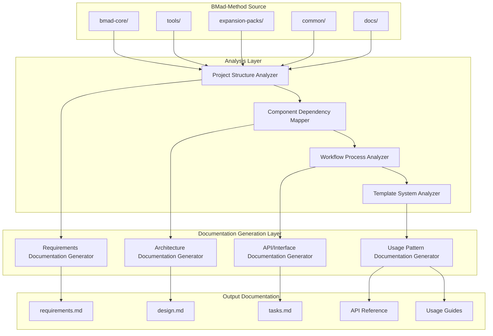

# Design Document

## Overview

The BMad-Method analysis and documentation system is designed to comprehensively analyze, understand, and document the Universal AI Agent Framework for Agentic Agile Driven Development. This system will create detailed technical documentation that captures the framework's architecture, workflows, components, and usage patterns to enable effective adoption and contribution.

The design follows a modular documentation approach that mirrors the BMad-Method's own natural language-first philosophy, creating comprehensive yet accessible documentation for developers, project managers, and contributors at all levels.

## Architecture

### High-Level System Architecture



### Core Analysis Components

#### 1. Project Structure Analyzer
- **Purpose**: Maps the complete BMad-Method directory structure and identifies all components
- **Input**: File system structure, configuration files
- **Output**: Hierarchical component map with relationships
- **Key Functions**:
  - Directory structure mapping
  - File type classification (agents, templates, tasks, workflows)
  - Configuration analysis (core-config.yaml, package.json)
  - Dependency relationship identification

#### 2. Component Dependency Mapper
- **Purpose**: Analyzes how agents, templates, tasks, and other components interconnect
- **Input**: YAML configurations, markdown files with dependency declarations
- **Output**: Dependency graph and resolution patterns
- **Key Functions**:
  - YAML dependency parsing
  - Cross-reference resolution
  - Circular dependency detection
  - Resource loading pattern analysis

#### 3. Workflow Process Analyzer
- **Purpose**: Documents the planning and development workflows
- **Input**: Workflow YAML files, user guide documentation, agent interaction patterns
- **Output**: Process flow documentation with decision points
- **Key Functions**:
  - Workflow sequence mapping
  - Agent interaction pattern analysis
  - State transition documentation
  - Critical handoff point identification

#### 4. Template System Analyzer
- **Purpose**: Analyzes the template processing system and markup language
- **Input**: Template YAML files, processing tasks, format specifications
- **Output**: Template system architecture and usage patterns
- **Key Functions**:
  - Template format specification analysis
  - Variable substitution pattern mapping
  - AI directive processing documentation
  - Template inheritance and composition analysis

## Components and Interfaces

### Core Documentation Components

#### Requirements Documentation Generator
```typescript
interface RequirementsGenerator {
  analyzeUserStories(): UserStory[]
  extractAcceptanceCriteria(): AcceptanceCriteria[]
  generateEARSFormat(): EARSRequirement[]
  validateRequirements(): ValidationResult
}
```

#### Architecture Documentation Generator
```typescript
interface ArchitectureGenerator {
  analyzeSystemComponents(): SystemComponent[]
  mapComponentRelationships(): ComponentRelationship[]
  generateArchitectureDiagrams(): MermaidDiagram[]
  documentDesignDecisions(): DesignDecision[]
}
```

#### API Documentation Generator
```typescript
interface APIDocGenerator {
  analyzeAgentInterfaces(): AgentInterface[]
  documentTaskSignatures(): TaskSignature[]
  generateTemplateSpecs(): TemplateSpecification[]
  createUsageExamples(): UsageExample[]
}
```

### Data Models

#### BMadComponent
```typescript
interface BMadComponent {
  id: string
  type: 'agent' | 'template' | 'task' | 'workflow' | 'checklist' | 'data'
  path: string
  dependencies: string[]
  metadata: ComponentMetadata
  content: string
}
```

#### WorkflowProcess
```typescript
interface WorkflowProcess {
  id: string
  name: string
  type: 'planning' | 'development' | 'hybrid'
  phases: WorkflowPhase[]
  agents: string[]
  artifacts: string[]
  transitions: StateTransition[]
}
```

#### AgentConfiguration
```typescript
interface AgentConfiguration {
  id: string
  name: string
  persona: PersonaDefinition
  dependencies: AgentDependencies
  commands: Command[]
  activationInstructions: string[]
  customization?: string
}
```

#### TemplateSpecification
```typescript
interface TemplateSpecification {
  id: string
  name: string
  version: string
  sections: TemplateSection[]
  workflow: WorkflowConfiguration
  outputFormat: OutputFormat
}
```

## Error Handling

### Analysis Error Handling
- **File System Errors**: Graceful handling of missing files, permission issues
- **YAML Parsing Errors**: Detailed error reporting with line numbers and context
- **Dependency Resolution Errors**: Clear reporting of missing or circular dependencies
- **Content Analysis Errors**: Fallback mechanisms for malformed content

### Documentation Generation Error Handling
- **Template Processing Errors**: Validation and error reporting for template issues
- **Cross-Reference Errors**: Detection and reporting of broken internal links
- **Format Validation Errors**: Markdown and YAML format validation
- **Output Generation Errors**: File system and permission error handling

### Error Recovery Strategies
- **Partial Analysis**: Continue analysis even when some components fail
- **Fallback Documentation**: Generate basic documentation when advanced analysis fails
- **Error Aggregation**: Collect and report all errors at completion
- **Retry Mechanisms**: Automatic retry for transient failures

## Testing Strategy

### Unit Testing
- **Component Analyzers**: Test each analyzer with mock file system data
- **Documentation Generators**: Verify output format and content accuracy
- **Data Models**: Validate serialization and deserialization
- **Error Handlers**: Test error conditions and recovery mechanisms

### Integration Testing
- **End-to-End Analysis**: Test complete analysis pipeline with real BMad-Method data
- **Cross-Component Dependencies**: Verify dependency resolution across components
- **Workflow Analysis**: Test complete workflow documentation generation
- **Output Validation**: Verify generated documentation meets requirements

### Test Data Management
- **Mock BMad Structures**: Create representative test data for all component types
- **Edge Case Scenarios**: Test with malformed, missing, and edge case data
- **Version Compatibility**: Test with different BMad-Method versions
- **Performance Testing**: Validate analysis performance with large codebases

### Validation Testing
- **Documentation Accuracy**: Verify generated documentation matches source
- **Link Validation**: Test all internal and external references
- **Format Compliance**: Ensure output follows specified formats
- **Completeness Testing**: Verify all components are documented

### Test Automation
- **Continuous Integration**: Automated testing on code changes
- **Regression Testing**: Ensure changes don't break existing functionality
- **Performance Monitoring**: Track analysis and generation performance
- **Quality Gates**: Automated quality checks for generated documentation

## Implementation Considerations

### Performance Optimization
- **Lazy Loading**: Load components only when needed for analysis
- **Caching**: Cache parsed YAML and analyzed components
- **Parallel Processing**: Analyze independent components concurrently
- **Memory Management**: Efficient handling of large codebases

### Extensibility
- **Plugin Architecture**: Support for custom analyzers and generators
- **Template System**: Configurable documentation templates
- **Output Formats**: Support for multiple output formats (Markdown, HTML, PDF)
- **Custom Workflows**: Support for organization-specific documentation workflows

### Maintainability
- **Modular Design**: Clear separation of concerns between analyzers and generators
- **Configuration-Driven**: Externalize configuration for easy customization
- **Logging and Monitoring**: Comprehensive logging for debugging and monitoring
- **Documentation**: Self-documenting code with comprehensive inline documentation